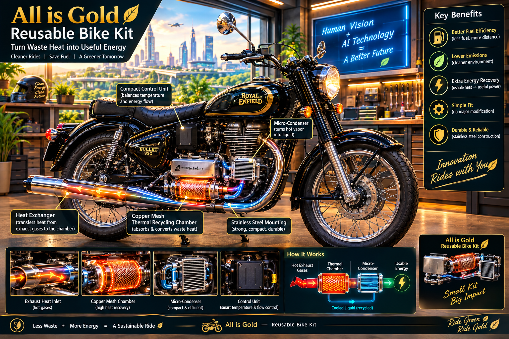

# All is Gold Reusable Bike Kit 🏍️♻️

> **"Turn Waste Heat into Useful Energy"**  
> *A collaborative open-source blueprint created by Human Vision and AI Technology for the public good.*

---

## 🖼️ Concept Design & Visual Blueprint

*(Above: Complete technical infographic showing the retrofitted classic motorcycle, self-cleaning thermal cracking chamber, mini-condenser, and step-by-step working schematics.)*

---

## 📌 Vision & Philosophy
Legacy carbureted motorcycles (100cc–150cc) are often discarded due to shifting emission standards and fuel costs, creating massive mechanical waste. The **"All is Gold Reusable Bike Kit"** is an open-source retrofit architecture designed to convert waste exhaust carbon and heat into clean, usable energy—giving old machines a brand-new, eco-friendly lease on life without proprietary restrictions.

---

## ⚙️ Core Technical Architecture

1. **Self-Cleaning Thermal Cracking Chamber:**
   * Uses high exhaust temperatures (600°C–700°C) near the header pipe to break down tar, sludge, and soot instantly into combustible syngas. 
   * **Result:** Zero manual maintenance and no clogged tubes.

2. **Mini-Condenser / Cooling Stage:**
   * Stabilizes gas temperatures before secondary re-injection using compact aluminum cooling fins, completely eliminating engine knocking.

3. **100% Fail-Safe Mechanical Safety:**
   * **Spring-Loaded Bypass Valve:** A purely mechanical pressure-relief mechanism. If any over-pressure occurs, the valve automatically routes exhaust gases safely through the main path, ensuring the bike **never stalls**.
   * **Flashback Arrestor (One-Way Check Valve):** Prevents secondary combustion feedback from reaching the engine.

4. **Thermal Energy Harvesting (TEG):**
   * Dual-stage Thermoelectric Generator (TEG) modules capture waste exhaust heat and convert it into low-voltage electricity for auxiliary valves or battery trickle-charging.

5. **Universal Fit:**
   * Built with high-grade **SS 304 / 316 Stainless Steel** and adjustable universal clamps to fit 80–100% of legacy carbureted models.

---

## 🛡️ Safety & Open-Source Declaration
* **Zero Electronic Dependency:** Mechanical safety takes precedence over sensors to guarantee primary vehicle reliability.
* **Public Domain / Open Source:** This blueprint is completely free. Mechanics, engineering students, and local manufacturers worldwide are free to build, modify, and deploy this kit to make sustainable transportation accessible to everyone.

*Created collaboratively by Ramarao Male & Artificial Intelligence.*
MIT License

Copyright (c) 2026 Ramarao Male & AI Collaborative

Permission is hereby granted, free of charge, to any person obtaining a copy
of this software and associated documentation files (the "Software"), to deal
in the Software without restriction, including without limitation the rights
to use, copy, modify, merge, publish, distribute, sublicense, and/or sell
copies of the Software, and to permit persons to whom the Software is
furnished to do so, subject to the following conditions:

The above copyright notice and this permission notice shall be included in all
copies or substantial portions of the Software.

THE SOFTWARE IS PROVIDED "AS IS", WITHOUT WARRANTY OF ANY KIND, EXPRESS OR
IMPLIED, INCLUDING BUT NOT LIMITED TO THE WARRANTIES OF MERCHANTABILITY, FITNESS
FOR A PARTICULAR PURPOSE AND NONINFRINGEMENT. IN NO EVENT SHALL THE AUTHORS OR
COPYRIGHT HOLDERS BE LIABLE FOR ANY CLAIM, DAMAGES OR OTHER LIABILITY, WHETHER
IN AN ACTION OF CONTRACT, TORT OR OTHERWISE, ARISING FROM, OUT OF OR IN
CONNECTION WITH THE SOFTWARE OR THE USE OR OTHER DEALINGS IN THE SOFTWARE.
